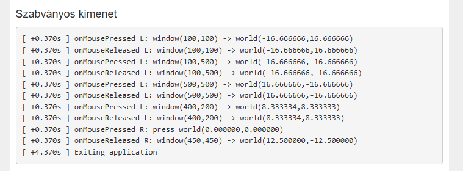

# GreenTriangle automatizációs keretrendszer

Kis, Windowsra fókuszáló automatizálási segéd, amely:

- Rögzített egéresemény-szkripteket játszik vissza a grafika háziddal (script mód)
- Két képrögzítési futás képeit hasonlítja össze pixelenkénti abszolút különbséggel (comparison mód)
- Interaktív nézőt nyit a két futás (és opcionális diff) megtekintéséhez egymás melletti, átfedéses és „split” nézettel (interactive mód)

Fájl: `automation_framework.py`


## Telepítés és előkészületek
0. **helper kód implementálása a saját projektedben:**

A programnak szüksége van egy olyan jól formattált stdout kimenetre, amely tartalmazza az egéreseményeket (lásd a „Tranzkript formátum” részt lent). Ezt a kimenetet a saját programodban kell előállítanod. Példa:

Sajnos a hülye keretrendszer nem enged semmit importálni, így időmérést bele kell iktatni a programod loopjába:

 
>**FONTOS! ⚠️⚠️⚠️**
>
> A kódodba ékelj be néhány használatlan változót! Az alap MOSS implementációt ez az egyszerű trükk megzavarhatja. Csak a változónév átírása nem elég, ténylegesen legyenek használatlan változók a kódban. Ha csak bemásolod a kódot, az másokkal együtt növeli a plágiumdetektálás esélyét, de önmagában nem kéne, hogy átbillentse a tresholdot. Figyelj erre!

```cpp
namespace {
	static double g_elapsedSeconds = 0.0;
	static bool g_elapsedInitialized = false;

	void setAppStart() {
		g_elapsedSeconds = 0.0;
		g_elapsedInitialized = true;
	}

	void addElapsed(double dt) {
		if (!g_elapsedInitialized) setAppStart();
		g_elapsedSeconds += dt;
	}

	void formatElapsed(char* buf, size_t bufsz) {
		if (!g_elapsedInitialized) {
			snprintf(buf, bufsz, "+0.000s");
			return;
		}
		long long secs = (long long)g_elapsedSeconds;
		long long rem = (long long)((g_elapsedSeconds - (double)secs) * 1000.0 + 0.5);
		if (rem >= 1000) { secs += 1; rem -= 1000; }
		snprintf(buf, bufsz, "+%lld.%03llds", secs, rem);
	}

	void debugPrintf(const char* fmt, ...) {
		char timebuf[32];
		formatElapsed(timebuf, sizeof(timebuf));
		printf("[ %s ] ", timebuf);
		va_list args;
		va_start(args, fmt);
		vprintf(fmt, args);
		va_end(args);
		fflush(stdout);
	}
}
```

Elindításhoz hívd meg a `setAppStart()`-ot, a fő loop-ban pedig minden frame-ben hívd meg az `addElapsed(dt)`-t, ahol `dt` az előző frame óta eltelt idő másodpercben.

```cpp
...
GreenTriangleApp() : glApp("Green triangle") { setAppStart(); }
...
```

```cpp
...
void onTimeElapsed(float startTime, float endTime) override {
	float dt = endTime - startTime;
	if (dt <= 0.0f) return;

	addElapsed((double)dt);
		const float maxStep = 0.02f;
		float remaining = dt;
		while (remaining > 0.0f) {
			float step = std::min(remaining, maxStep);
			// A te frissítési logikád itt jön
			remaining -= step;
		}
		// Egyéb renderelési logika
	}
...
```
Emellett fontos, hogy az stdoutra íráshoz használd a `debugPrintf`-et!

1. **Függőségek telepítése:**

Futtasd a `create_venv_and_install.bat` fájlt a virtuális környezet létrehozásához és a függőségek telepítéséhez. Ez megnyit egy új PowerShell ablakot az aktivált környezettel, ahol futtathatod a parancsokat.

```powershell
.\create_venv_and_install.bat
```

2. **Eventek kinyerése:**

JPortán megtalálható stdout kimenetet mentsd le egy fájlba. Az itteni kimeneti mintát meg kell valósítanod a saját programodban hogy a program felismerje az eseményeket.


## Használati példa

Először futtasd a `create_venv_and_install.bat` fájlt a környezet beállításához. Ez után minden parancsot az új PowerShell ablakban futtass, ahol a virtuális környezet aktiválva van.

2) **Futtasd a script módot az események visszajátszásához és képernyőképek mentéséhez:**

```powershell
python automation_framework.py --mode script --script events.txt --exe .\glProgram\x64\Debug\GreenTriangle.exe --window-title "Green triangle" --output .\screenshots\run01 --capture-delay 0.05
```

3) **Ismételd meg a második futáshoz:**

```powershell
python automation_framework.py --mode script --script events.txt --exe .\glProgram\x64\Debug\GreenTriangle.exe --window-title "Green triangle" --output .\screenshots\run02 --capture-delay 0.05
```

4) **Készíts képenkénti abszolút különbségeket:**

```powershell
python automation_framework.py --mode comparison --inputs .\screenshots\run01 .\screenshots\run02 --output .\screenshots\comparison01
```

5) **Nézd meg interaktívan:**

```powershell
python automation_framework.py --mode interactive --inputs .\screenshots\run01 .\screenshots\run02 .\screenshots\comparison01
```

## Módok

### script
Szöveges tranzkriptből visszajátssza az egéreseményeket, fókuszálja a célt ablakot, a felvett kliens-területi koordinátákra kattint, és minden esemény után képernyőképet ment (indítás után és kilépés előtt is).

Kötelező paraméterek:
- `--script PATH` — tranzkript fájl (pl. `events.txt`)
- `--exe PATH` — a `GreenTriangle.exe` elérési útja

Hasznos paraméterek:
- `--window-title TEXT` — a főablak pontos címe (ha üres, a legfelső ablakot keresi)
- `--output DIR` — a képernyőképek célkönyvtára (alapból a `--screenshots` értéke)
- `--screenshots DIR` — régi kimeneti kapcsoló (akkor használatos, ha nincs `--output`)
- `--capture-delay FLOAT` — extra várakozás minden képkivágás előtt a stabil frame-hez (pl. `0.05`)
- `--pointer-duration FLOAT` — egérmozgatás animációjának hossza (másodperc)
- `--launch-wait FLOAT` — plusz várakozás, miután az ablak kész
- `--window-timeout FLOAT` — a főablak megjelenéséig várakozás
- `--exit-timeout FLOAT` — a folyamat kilépéséig várakozás a lejátszás végén
- `--log-level {DEBUG,INFO,WARNING,ERROR}`

Kimenet elnevezése:
- A fájlnevek futó indexet és eseménycímkét tartalmaznak, pl. `000_0000_after_launch.png`, `001_000_..._mouse_press_left.png`.
- Elsődlegesen a kliens-területet vágja ki; hiba esetén teljes ablakra vagy teljes képernyőre esik vissza.

### comparison
Abszolút (pixelenkénti) különbséget készít két könyvtár azonos nevű képfájljai között. A különbség a `PIL.ImageChops.difference` műveletének felel meg, amely csatornánkénti abszolút különbséget számol.

Kötelező paraméterek:
- `--inputs DIR_A DIR_B` — két bemeneti könyvtár, egyező nevű `.png` fájlokkal
- `--output DIR` — az `_diff.png` képek célkönyvtára

Viselkedés:
- Csak a mindkét könyvtárban megtalálható fájlneveket dolgozza fel.
- Méreteltérés esetén a képet kihagyja és figyelmeztet.
- Az egyezés nélkülieket naplózza és kihagyja.

### interactive
Egyszerű képnézegetőt nyit két futás (és opcionálisan egy előre legenerált diff-könyvtár) képeihez.

Paraméterek:
- `--inputs DIR_A DIR_B [DIR_DIFF]` — két kötelező könyvtár; a harmadik (opcionális) a diff nézethez

Billentyűparancsok:
- `Left` / `Right` — előző / következő kép
- `1` — egymás mellett (A | B)
- `2` — átfedés (A a B-n), állítható alphával
- `3` — split nézet (A balra, B jobbra), húzható elválasztóval
- `4` — diff (ha van előre számolt diff, azt mutatja; különben menet közben számol)
- `[` / `]` — átfedés alpha csökkentése / növelése
- `,` / `.` — split pozíció balra / jobbra
- `F` — képernyőhöz igazítás ki/be
- `H` vagy `?` — súgósor ki/be

Vizuális segítség:
- Split módban egy sárga függőleges vonal jelöli a pontos elválasztási pozíciót.
- A kurzor split módban vízszintes átméretezésre vált a jobb érthetőségért.

## Tippek stabil, megismételhető képkivágáshoz

- Használd a kliens-területi kivágást (alapértelmezett); az OS felület és értesítések zajt vihetnek a képekbe.
- Adj `--capture-delay 0.03`–`0.10` másodpercet, hogy a frame teljesen kirajzolódjon.
- Kerüld az átfedő ablakokat, tooltipeket, illetve a kézi egérmozgatást felvétel közben.
- Tartsd állandóan az ablak méretét és a DPI skálázást a futások között.
- Használd ugyanazt a `--window-title` értéket, és lehetőleg ne válts ablakot indítás közben.

## Hibaelhárítás

- **Nincs összehasonlítási kimenet:** figyelj, hogy az útvonal ne egy magányos backslash-sel kezdődjön (használd a `.\screenshots\comparison01` formát vagy abszolút utat). A program a hiányzó könyvtárakat létrehozza.
- **Ablak nem található:** ellenőrizd a `--window-title` értékét, és hogy az EXE látható UI-t nyit-e a `--window-timeout` időn belül.
- **Jogosultsági gondok:** ha más folyamat blokkolja az UI automatizálást, futtasd a terminált Rendszergazdaként.
- **Hiányzó Tkinter:** az interaktív módhoz szükséges. A Windowsos Python telepítő tartalmazza; egyedi disztribúciónál engedélyezd/telepítsd.
- **Lag:** Ha a grafika program elfoglal egy teljes magot, a visszajátszás és képkivágás közben a rendszer túlterhelődhet, ami késleltetést okozhat az események feldolgozásában. Próbáld meg növelni a `--capture-delay` értékét, vagy futtasd a grafika programot egy kevésbé terhelt környezetben. így sem garantált a pontos időzítés! Erre egy másik megoldás lehet ha kérsz egy executablet, ahol a dt meg van szorozva egy kis értékkel, így a program „lassabban” fut, és több idő jut az események feldolgozására.

## Tranzkript formátum
Példa eseménysorok (idők relatívak):

```
[ +0.370s ] onMousePressed L: window(100,100) -> world(-16.666666,16.666666)
[ +0.370s ] onMouseReleased L: window(100,100) -> world(-16.666666,16.666666)
[ +4.370s ] Exiting application
```

A parser a következőket olvassa ki:
- Eseményidőzítés (delta) és monoton per-esemény késleltetés
- Egér lenyomás/felengedés bal/jobb gombbal
- Opcionális ablakkoordináta és világkoordináta (a visszajátszáshoz az ablakkoordinátát használja)

Ezeket a módosításokat a `automation_framework.py` fájlban végezd el.</span>

## Licenc
Mittudom én, nem vagyok jogász, csak egy vibecoder mérnöktanonc. (Asszem MIT vagy valami hasonló.)